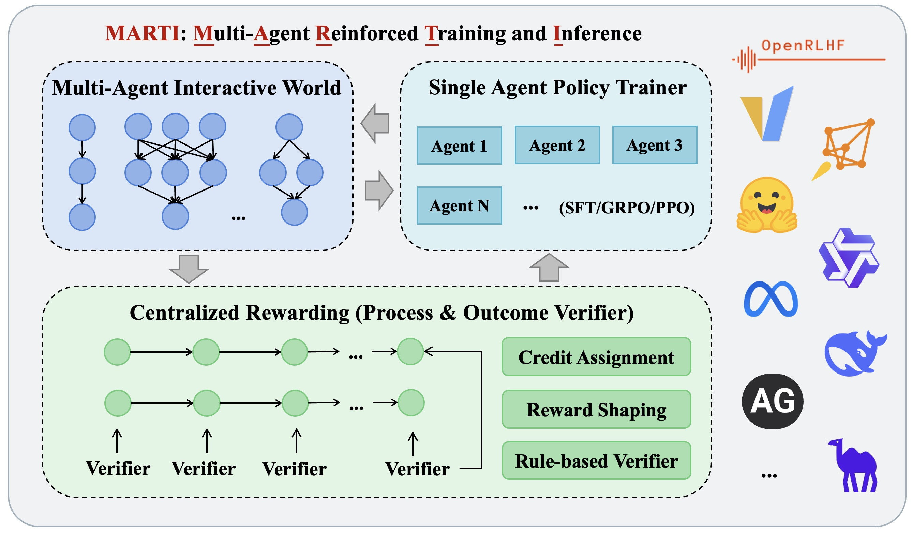

# Overview of MARTI

We designed the MARTI framework following the principle of centralized multi-agent interaction with distributed policy training, where all agent interactions and reward allocation occur centrally while policy training is distributed across individual agents.
As illustrated in Figure 1, MARTI comprises three core modules:

  

<i>Figure 1: Overview of Core Components of MARTI</i>

## Multi-Agent World
This module serves as the environment for all multi-agent interactions and workflow definitions. The world supports both built-in workflows and integration with third-party frameworks, such as AutoGen and CAMEL. We detail various workflow definitions in following sections, including: (1) built-in workflows based on multi-agent graphs, which provide typical configurations such as multi-agent debate, mixture-of-agents, and chain-of-agents while supporting adaptive workflows through custom configurations; and (2) third-party framework integrations in , where trajectories are collected from built-in logging systems and conversations, with MAS inference and training fully decoupled for flexible applications.

## Centralized Reward Models
Following world interactions, this module collects trajectories and performs credit assignment and reward shaping. Initial global rewards are computed using either rule-based strategies or generative reward models, which are then decomposed into agent-level rewards for subsequent agent training. We firstly introduce rule-based rewards (e.g., DeepSeek-R1) and influence-aware reward shaping for MAS. For open-domain applications, we introduce generative reward models that extend to LLM-as-judge approaches for multi-agent reward allocation across roles and collaborations. We also describe tree-based AgentPRM for long-term collaborations, adapting prior PRM methods for credit assignment in mathematical reasoning tasks.

## Agent Policy Trainer
After trajectory collection and reward allocation, MARTI distributes agent-specific trajectories and rewards to individual policy trainers. Here, backbone LLMs undergo supervised fine-tuning or reinforcement learning. Leveraging distributed training capabilities, we implement various RL algorithms from OpenRLHF, including REINFORCE++, GRPO,  and PPO, while maintaining extensibility for novel algorithms such as PRIME. We additionally integrate supervised fine-tuning during on-policy rollout training to enhance stability and accelerate convergence. These dynamic training strategies warrant further investigation regarding on-policy and off-policy combinations.
